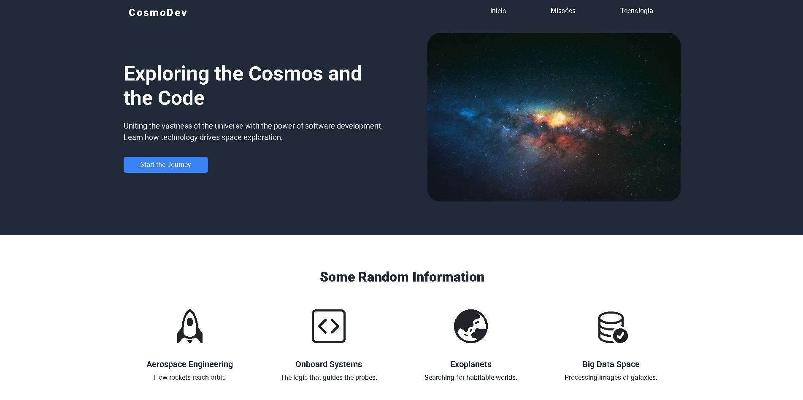

# 🌌 CosmoDev - Landing Page

Este é um projeto desenvolvido como parte dos meus estudos no **The Odin Project**, com o objetivo de praticar a construção de layouts modernos e responsivos utilizando HTML, CSS e Bootstrap.

O design segue uma proposta visual inspirada no universo e na tecnologia, conectando o tema espacial com desenvolvimento de software.

---

## 📌 Sobre o projeto

A **CosmoDev Landing Page** apresenta uma interface moderna com foco em:

* Estruturação semântica com HTML5
* Estilização com CSS3 e variáveis
* Layout responsivo (mobile-first)
* Uso de **Flexbox** e **CSS Grid**
* Integração com **Bootstrap**
* Ícones com Bootstrap Icons

---

## 🎯 Objetivo

Este projeto foi desenvolvido como **projeto estudantil**, com base nos conceitos aprendidos durante o curso do **The Odin Project**, reforçando habilidades essenciais de front-end.

---

## 🖼️ Preview do projeto

---

## 🔗 Acesse o projeto

* 🚀 **Deploy (GitHub Pages):** [https://anaclarissi.github.io/landing-page-odin-project/](https://anaclarissi.github.io/landing-page-odin-project/)
* 💻 **Repositório:** [https://github.com/anaClarissi/landing-page-odin-project](https://github.com/anaClarissi/landing-page-odin-project)
* 👩‍💼 **LinkedIn:** [https://linkedin.com/in/anaclarissi](https://linkedin.com/in/anaclarissi)

---

## ⚙️ Tecnologias utilizadas

* HTML5
* CSS3
* Bootstrap 5
* Bootstrap Icons
* Google Fonts (Roboto)

---

## 💡 Aprendizados

Durante o desenvolvimento deste projeto, eu pude praticar:

* Organização de código e boas práticas
* Criação de layouts responsivos
* Uso de variáveis CSS para padronização
* Combinação de Bootstrap com CSS personalizado
* Estruturação de componentes reutilizáveis

---

## 📚 Créditos

Este projeto é um **projeto educacional**, desenvolvido a partir dos desafios propostos pelo:

* The Odin Project

---

## 👩‍🚀 Autora

Feito com dedicação por **Ana Clarissi** 💙

* GitHub: [https://github.com/anaClarissi](https://github.com/seu-usuario)
* LinkedIn: [https://linkedin.com/in/anaclarissi](https://linkedin.com/in/seu-linkedin)